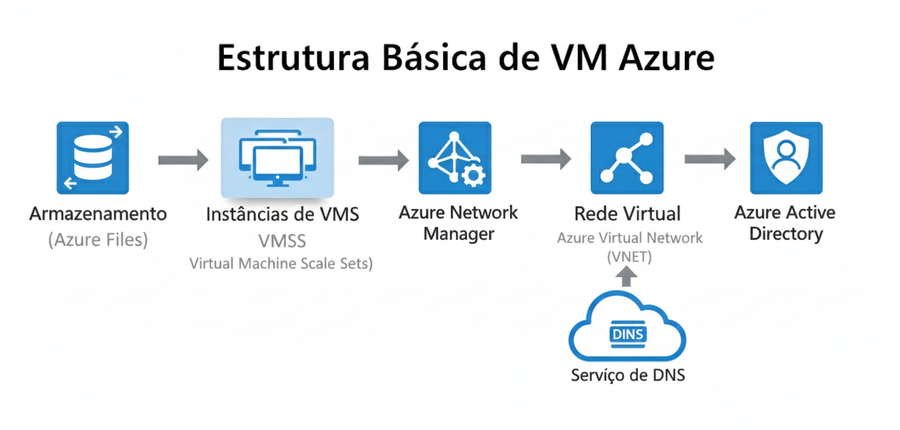
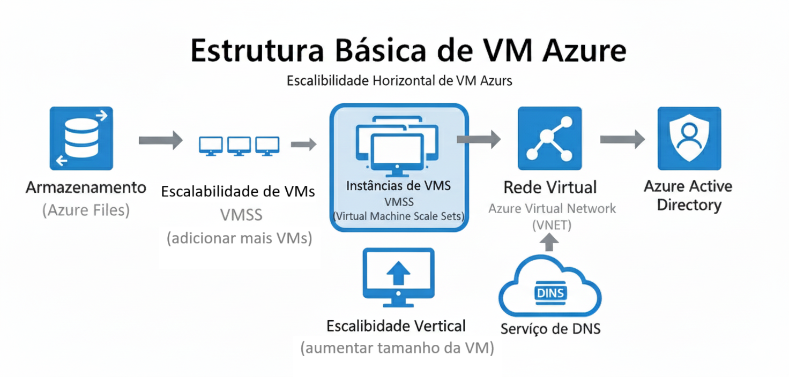
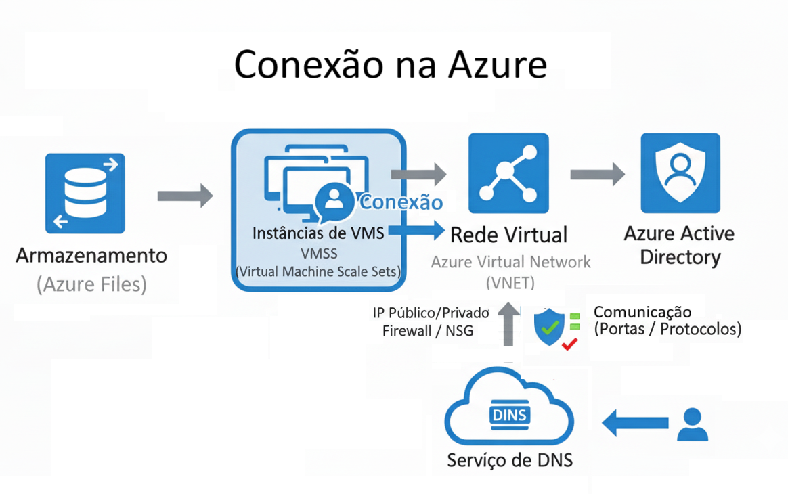
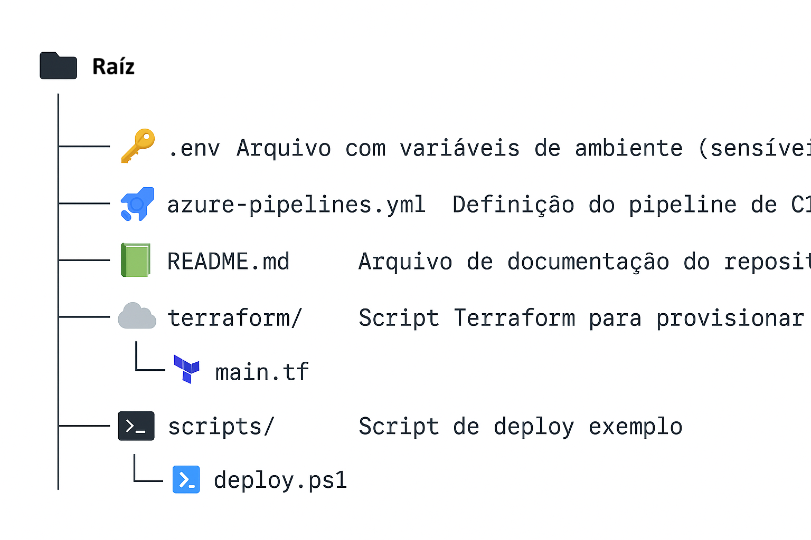
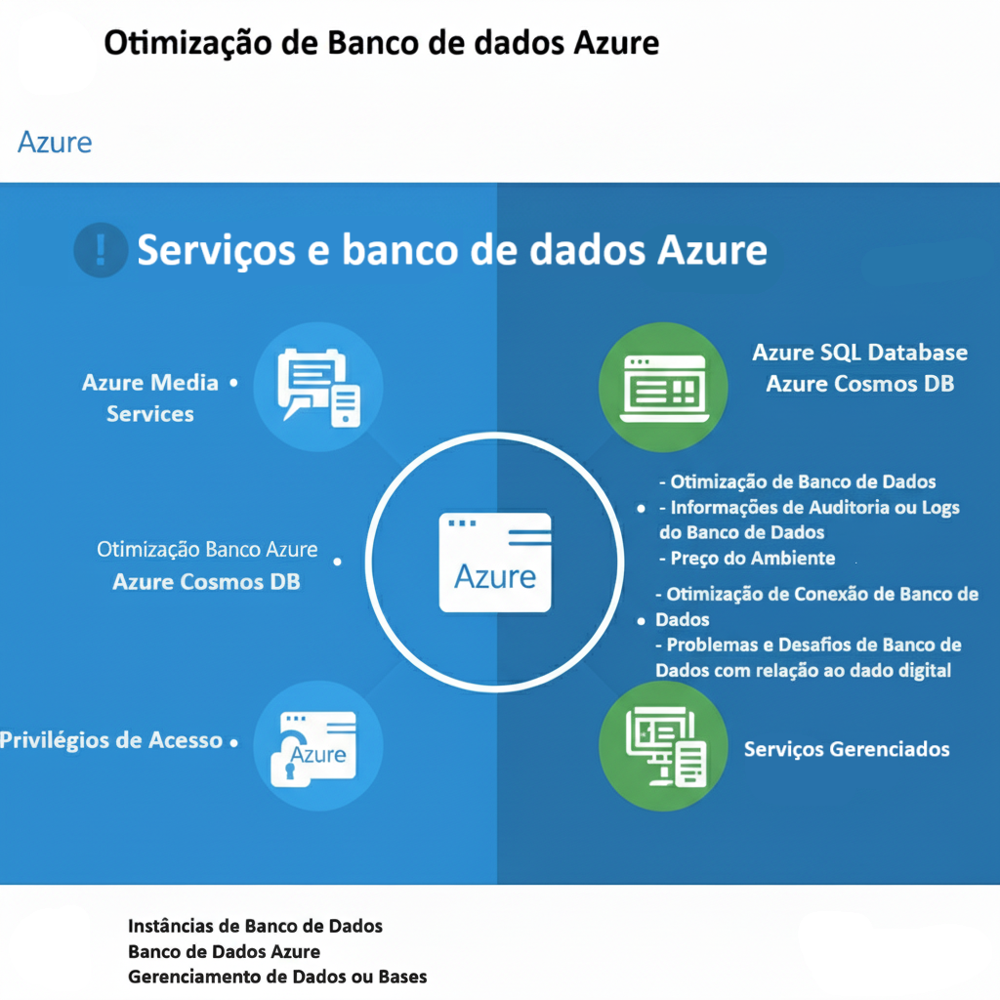

# Azure DevOps e Configuração de Banco de Dados Azure

Este repositório contém minhas experiências com o Azure DevOps e a configuração de bancos de dados na plataforma Microsoft Azure. Aqui estão alguns dos tópicos abordados:

- Configuração de pipelines de CI/CD
- Gerenciamento de repositórios Git
- Implementação de testes automatizados
- Monitoramento e relatórios de desempenho
- Integração com outras ferramentas e serviços
- Configuração e gerenciamento de bancos de dados Azure

Sinta-se à vontade para explorar os exemplos e contribuir com suas próprias experiências!

## Azure Virtual Machines

Este repositório também explora o uso de Máquinas Virtuais Azure para hospedar aplicações e serviços. As Máquinas Virtuais Azure oferecem flexibilidade e controle sobre o ambiente de hospedagem, permitindo que você personalize a configuração de hardware e software de acordo com suas necessidades. Com as VMs Azure, você pode criar e gerenciar máquinas virtuais em datacenters da Microsoft, escolhendo entre uma variedade de sistemas operacionais, tamanhos de VM e configurações de armazenamento. Isso permite que você execute aplicativos em um ambiente escalável e sob demanda, pagando apenas pelos recursos que você usa.

### Estrutura Básica

A estrutura básica de uma Máquina Virtual Azure envolve a criação de uma instância de máquina virtual, a configuração de armazenamento para os discos virtuais e a configuração de uma rede virtual para permitir a comunicação com a máquina virtual. Ao criar uma VM, você precisa especificar o sistema operacional, o tamanho da VM (que determina a quantidade de CPU, memória e armazenamento), a região onde a VM será hospedada e as configurações de rede. Os discos virtuais são usados para armazenar o sistema operacional, aplicativos e dados da VM. A rede virtual permite que a VM se comunique com outros recursos do Azure e com a Internet.



### Escalabilidade

Uma das principais vantagens das Máquinas Virtuais Azure é a capacidade de escalar verticalmente (aumentar o tamanho da VM) ou horizontalmente (aumentar o número de VMs) para atender às demandas de carga de trabalho. A escalabilidade vertical envolve a alteração do tamanho da VM para um tamanho maior ou menor, dependendo das necessidades de recursos. A escalabilidade horizontal envolve a criação de várias instâncias da VM e o uso de um balanceador de carga para distribuir o tráfego entre as instâncias. Isso permite que você lide com picos de tráfego e garanta a disponibilidade do seu aplicativo.



### Conexão

A conexão com a máquina virtual é feita através de um endereço IP público ou privado, dependendo da configuração da rede virtual. É possível configurar regras de firewall para permitir ou negar o acesso a determinados serviços e portas. Para se conectar a uma VM Azure, você pode usar um cliente SSH (para VMs Linux) ou um cliente de Área de Trabalho Remota (para VMs Windows). Você também pode usar o Azure Bastion para se conectar a VMs de forma segura através do portal do Azure.



## Objetivos

Este projeto tem como objetivos:

- Aplicar os conceitos aprendidos em um ambiente prático: Colocar em prática os conhecimentos teóricos adquiridos sobre Azure, através da implementação de soluções e serviços na plataforma.
- Documentar processos técnicos de forma clara e estruturada: Criar documentação detalhada e organizada dos processos de configuração, implantação e gerenciamento de recursos na Azure, facilitando a compreensão e reprodução dos mesmos.
- Utilizar o GitHub como ferramenta para compartilhamento de documentação técnica: Utilizar o GitHub como plataforma para hospedar e compartilhar a documentação técnica criada, permitindo que outros usuários possam acessar, contribuir e se beneficiar do conhecimento compartilhado.
- Praticar o processo de configuração de uma instância de Banco de Dados na plataforma Microsoft Azure: Realizar a configuração completa de uma instância de Banco de Dados na Azure, desde a criação do recurso até a configuração de segurança e otimização de desempenho.

## Entregáveis

O entregável principal deste desafio é a criação de um repositório que demonstre a aplicação de práticas DevOps no contexto da Azure. Este repositório deverá servir como um guia prático e um ponto de partida para a implementação de soluções robustas e eficientes na nuvem. Os seguintes elementos devem estar presentes:

-   **Infraestrutura como Código (IaC):** Um exemplo prático é o script Terraform que está localizado na pasta `terraform/main.tf` que provisiona um grupo de recursos, uma rede virtual com sub-redes, uma máquina virtual com um sistema operacional específico e um balanceador de carga para distribuir o tráfego entre as instâncias da VM. O script utiliza variáveis de ambiente para configurar o nome da máquina virtual, o nome de usuário e a senha do administrador. As variáveis de ambiente são definidas no arquivo `.env` que está localizado na raiz do repositório. O script deve ser versionado em um repositório Git e executado através de um pipeline de CI/CD no Azure DevOps.

-   **Pipelines de Integração Contínua e Entrega Contínua (CI/CD):** Um exemplo prático é o arquivo `azure-pipelines.yml` que define um pipeline no Azure DevOps para construir, testar e implantar a aplicação. O pipeline é acionado automaticamente sempre que há uma alteração no código-fonte. Ele executa testes unitários, testes de integração e testes de aceitação para garantir a qualidade do código. Em seguida, ele empacota a aplicação e a implanta em um ambiente de teste. Após a aprovação, ele implanta a aplicação em um ambiente de produção. As informações confidenciais, como a assinatura do Azure e o nome do aplicativo Web, são armazenadas em grupos de variáveis no Azure DevOps e referenciadas no pipeline usando a sintaxe `$(variableName)`. Isso garante que as informações confidenciais não sejam armazenadas no código-fonte.

#### Definindo as variáveis de ambiente no Azure DevOps

1.  No Azure DevOps, navegue até o seu projeto.
2.  No menu à esquerda, selecione **Pipelines** e, em seguida, selecione **Library**.
3.  Selecione **+ Variable group**.
4.  Digite um nome para o grupo de variáveis (por exemplo, "AzureVariables").
5.  Adicione as variáveis necessárias (por exemplo, "azureSubscription" e "appName") e seus respectivos valores.
6.  Para variáveis que contêm informações confidenciais, marque a caixa de seleção **Keep this value secret**.
7.  Salve o grupo de variáveis.
8.  No seu pipeline, adicione uma tarefa **Variable group** e selecione o grupo de variáveis que você criou.

-   **Monitoramento e Observabilidade:** Para implementar o monitoramento e a observabilidade na Azure, você pode usar o Azure Monitor e o Application Insights.

    1.  **Azure Monitor:** O Azure Monitor coleta métricas e logs de recursos da Azure, como máquinas virtuais, bancos de dados e aplicativos Web. Você pode usar o Azure Monitor para monitorar a integridade e o desempenho de seus recursos, configurar alertas e criar painéis personalizados.
    2.  **Application Insights:** O Application Insights é um serviço de monitoramento de desempenho de aplicativos (APM) que coleta dados de telemetria de seus aplicativos Web, como solicitações, exceções e dependências. Você pode usar o Application Insights para identificar e diagnosticar problemas de desempenho, entender o comportamento do usuário e melhorar a experiência do usuário.

    Para configurar o Application Insights, você precisa adicionar o SDK do Application Insights ao seu aplicativo Web e configurar a chave de instrumentação. Em seguida, você pode usar o portal do Azure para visualizar os dados de telemetria coletados pelo Application Insights.

-   **Gerenciamento de Configuração:** Para automatizar a configuração e o gerenciamento de servidores e aplicações na Azure, você pode usar ferramentas de gerenciamento de configuração como Ansible, Chef e Puppet.

    1.  **Ansible:** O Ansible é uma ferramenta de automação de código aberto que usa arquivos YAML para definir o estado desejado de seus servidores e aplicações. Você pode usar o Ansible para automatizar tarefas como a instalação de software, a configuração de arquivos e a implantação de aplicações.
    2.  **Chef:** O Chef é uma ferramenta de automação que usa "cookbooks" para definir o estado desejado de seus servidores e aplicações. Você pode usar o Chef para automatizar tarefas como a instalação de software, a configuração de arquivos e a implantação de aplicações.
    3.  **Puppet:** O Puppet é uma ferramenta de gerenciamento de configuração que usa uma linguagem declarativa para definir o estado desejado de seus servidores e aplicações. Você pode usar o Puppet para automatizar tarefas como a instalação de software, a configuração de arquivos e a implantação de aplicações.

    Para usar essas ferramentas, você precisa instalar o agente da ferramenta em seus servidores Azure e, em seguida, definir o estado desejado de seus servidores e aplicações usando a linguagem específica da ferramenta.

-   **Segurança como Código (SaC):** Para implementar práticas de Segurança como Código (SaC) na Azure, você pode usar ferramentas de análise estática de código (SAST) e análise dinâmica de código (DAST) para identificar vulnerabilidades de segurança em suas aplicações. Além disso, é importante configurar políticas de segurança e conformidade na Azure para garantir a proteção dos dados e dos recursos. A Azure oferece diversas ferramentas e serviços para implementar SaC, incluindo:

    1.  **Azure Security Center:** O Azure Security Center fornece uma visão centralizada do estado de segurança de seus recursos da Azure. Ele avalia continuamente seus recursos e fornece recomendações de segurança para ajudá-lo a melhorar sua postura de segurança. Você pode usar o Azure Security Center para monitorar ameaças, detectar vulnerabilidades e configurar políticas de segurança.
    2.  **Azure Policy:** O Azure Policy permite que você defina e aplique políticas de segurança e conformidade em seus recursos da Azure. Você pode usar o Azure Policy para garantir que seus recursos estejam em conformidade com os padrões de segurança e conformidade da sua organização. Por exemplo, você pode usar o Azure Policy para exigir que todas as máquinas virtuais tenham o monitoramento de segurança habilitado ou para impedir a criação de máquinas virtuais em regiões não aprovadas.
    3.  **Azure Key Vault:** O Azure Key Vault permite que você armazene e gerencie segredos, chaves e certificados de forma segura. Você pode usar o Azure Key Vault para proteger informações confidenciais, como senhas, chaves de API e cadeias de conexão. O Azure Key Vault também fornece recursos de auditoria e controle de acesso para garantir que apenas usuários e aplicativos autorizados possam acessar seus segredos.
    4.  **Azure DevOps Security Code Analysis:** Você pode integrar ferramentas SAST e DAST em seus pipelines do Azure DevOps para automatizar a análise de segurança do seu código. Isso permite que você identifique e corrija vulnerabilidades de segurança antes que o código seja implantado em produção.



## Estrutura do Repositório Azure

```
Raíz do Repositório
├── .env                      # Arquivo com variáveis de ambiente (sensíveis)
├── azure-pipelines.yml       # Definição do pipeline de CI/CD no Azure DevOps
├── README.md                 # Arquivo de documentação do repositório
├── terraform/                # Diretório contendo os scripts Terraform
│   └── main.tf             # Script Terraform para provisionar a infraestrutura
└── scripts/                  # Diretório para scripts auxiliares (ex: PowerShell, Bash)
    └── deploy.ps1          # Script de deploy exemplo
```

## Executando o script de implantação

Para executar o script de implantação `deploy.ps1`, você precisa:

1.  Ter o módulo Az PowerShell instalado. Você pode instalar o módulo Az PowerShell usando o seguinte comando:

    ```powershell
    Install-Module -Name Az -AllowClobber -Force
    ```

2.  Estar conectado à sua conta do Azure. Você pode se conectar à sua conta do Azure usando o seguinte comando:

    ```powershell
    Connect-AzAccount
    ```

3.  Definir o ID da sua assinatura do Azure, o nome do aplicativo Web e o grupo de recursos no arquivo `.env`.

4.  Substituir o valor da variável `$publishPath` no script `deploy.ps1` pelo caminho real da sua pasta de publicação.

5.  Executar o script `deploy.ps1` usando o seguinte comando:

    ```powershell
    .\scripts\deploy.ps1
    ```

## Configuração de Banco de Dados Azure

Este repositório também explora o processo de configuração de uma instância de Banco de Dados na plataforma Microsoft Azure. A configuração de um banco de dados na Azure envolve as seguintes etapas:

1.  **Escolha do tipo de banco de dados:** Selecionar o tipo de banco de dados mais adequado para as suas necessidades, como SQL Database, Cosmos DB, MySQL, PostgreSQL ou MariaDB. Cada um oferece diferentes modelos de dados, escalabilidade e custos.

2.  **Criação do recurso de banco de dados:** Criar uma instância do banco de dados escolhido no portal do Azure, especificando:

    *   **Assinatura:** A assinatura do Azure na qual o banco de dados será criado.
    *   **Grupo de recursos:** Um grupo de recursos existente ou novo para organizar o banco de dados e recursos relacionados.
    *   **Nome do banco de dados:** Um nome único para identificar o banco de dados.
    *   **Localização:** A região do Azure onde o banco de dados será hospedado (escolha a mais próxima dos seus usuários).
    *   **Servidor:** Para SQL Database, MySQL, PostgreSQL e MariaDB, você precisará de um servidor lógico. Crie um novo ou use um existente.
    *   **Nível de preço:** Selecione um nível de preço (e tamanho, se aplicável) que atenda às suas necessidades de desempenho e orçamento.
    *   **Configurações adicionais:** Configure opções como backups, segurança e rede.

3.  **Configuração de regras de firewall:** Configurar regras de firewall para permitir o acesso ao banco de dados a partir de endereços IP específicos ou de outros serviços da Azure. É crucial configurar as regras de firewall corretamente para garantir a segurança do seu banco de dados.

    *   **SQL Database:** Normalmente usa a porta 1433 (TCP). O protocolo é o TDS (Tabular Data Stream). Para controlar o acesso, você pode permitir intervalos de IP específicos ou usar o recurso de "Virtual Network Service Endpoints" para permitir o acesso apenas de sub-redes específicas na sua rede virtual.
    *   **MySQL:** Usa a porta 3306 (TCP). O protocolo é o MySQL Protocol. Semelhante ao SQL Database, você pode controlar o acesso por meio de regras de IP ou usar "Virtual Network Service Endpoints".
    *   **PostgreSQL:** Usa a porta 5432 (TCP). O protocolo é o PostgreSQL Protocol. O controle de acesso é feito da mesma forma que o MySQL.
    *   **Cosmos DB:** Usa a porta 443 (HTTPS) para a API do SQL e outras APIs específicas. O protocolo é HTTPS. O controle de acesso é feito por meio de chaves de acesso e/ou "Virtual Network Service Endpoints".

    Ao configurar as regras de firewall, considere se você precisa de conexões *stateful* ou *stateless*. Conexões *stateful* mantêm o estado da conexão entre o cliente e o servidor, o que pode ser útil para aplicativos que precisam de comunicação contínua. No entanto, conexões *stateless* são mais escaláveis e resilientes, pois cada solicitação é independente e não depende do estado anterior. Para a maioria dos bancos de dados, conexões *stateless* são preferíveis, pois permitem que o banco de dados lide com um grande número de conexões simultâneas e se recupere mais facilmente de falhas.

4.  **Criação de usuários e permissões:** Criar usuários com diferentes níveis de acesso ao banco de dados, atribuindo permissões específicas para cada usuário. É fundamental seguir as melhores práticas para garantir a segurança e o controle de acesso adequados:

    *   **Princípio do menor privilégio:** Conceda aos usuários apenas as permissões mínimas necessárias para realizar suas tarefas.
    *   **Utilize grupos (roles):** Em vez de atribuir permissões diretamente aos usuários, crie grupos (ou roles) com permissões específicas e adicione os usuários aos grupos apropriados. Isso simplifica o gerenciamento de permissões e garante a consistência.
    *   **Nomes descritivos:** Use nomes descritivos para usuários e grupos para facilitar a identificação de suas funções e responsabilidades.
    *   **Autenticação forte:** Embora a autenticação multifator (MFA) não seja aplicada diretamente no banco de dados, é crucial proteger o acesso ao ambiente Azure que gerencia o banco de dados com MFA.

    No ambiente Azure, você pode gerenciar usuários e permissões usando as ferramentas e interfaces específicas para cada tipo de banco de dados. Para garantir o acesso seguro, utilize os seguintes recursos:

    *   **Azure Active Directory (Azure AD) Multi-Factor Authentication:** O Azure AD MFA fornece uma camada adicional de segurança, exigindo que os usuários forneçam uma segunda forma de autenticação (como um código enviado para o celular) além de sua senha. Habilite o Azure AD MFA para todos os usuários que acessam o portal do Azure ou usam ferramentas de gerenciamento para interagir com os recursos do banco de dados.
    *   **Azure Active Directory (Azure AD) Conditional Access:** Configure políticas de Acesso Condicional no Azure AD para exigir MFA com base em condições específicas, como localização, dispositivo ou risco de login. Isso permite que você aplique o MFA de forma seletiva, com base no risco associado a cada tentativa de acesso.
    *   **Azure Bastion:** Use o Azure Bastion para fornecer acesso seguro às máquinas virtuais que hospedam ferramentas de gerenciamento de banco de dados (como o SSMS). O Azure Bastion permite que os usuários se conectem às VMs por meio do portal do Azure, sem expor as VMs à Internet.
    *   **Just-In-Time (JIT) Access:** Use o Azure Security Center para habilitar o acesso Just-In-Time às VMs que hospedam ferramentas de gerenciamento de banco de dados. O acesso JIT permite que os usuários solicitem acesso temporário às VMs, o que reduz o risco de acesso não autorizado.

    As ferramentas e interfaces específicas para cada tipo de banco de dados são:

    *   **SQL Database:** Use o SQL Server Management Studio (SSMS) ou o portal do Azure para criar logins (usuários) e atribuir permissões a eles. Você pode criar roles de banco de dados (db\_datareader, db\_datawriter, db\_owner, etc.) e adicionar usuários a esses roles.
    *   **MySQL/PostgreSQL:** Use o cliente de linha de comando (mysql ou psql) ou ferramentas de administração como o MySQL Workbench ou pgAdmin para criar usuários e conceder privilégios (SELECT, INSERT, UPDATE, DELETE, etc.) a eles.
    *   **Cosmos DB:** Use o portal do Azure ou a CLI do Azure para criar usuários e atribuir roles a eles. O Cosmos DB oferece roles predefinidos (Cosmos DB Built-in Data Reader, Cosmos DB Built-in Data Contributor, etc.) e permite criar roles personalizados.

5.  **Configuração de backups e replicação:** Configurar backups automáticos do banco de dados para garantir a recuperação em caso de falhas, e configurar a replicação para garantir a alta disponibilidade e a escalabilidade. A Azure oferece diversas opções para backups e replicação, e é importante escolher as opções certas para suas necessidades:

    *   **Backups:**

        *   **Tipos de backup:**

            *   **Backup completo:** Faz backup de todo o banco de dados.
            *   **Backup diferencial:** Faz backup apenas das alterações desde o último backup completo. Um backup diferencial armazena todas as alterações feitas desde o último backup completo. Restaurar um backup diferencial requer o backup completo mais recente e o backup diferencial.
            *   **Backup de log de transações:** Faz backup de todos os logs de transações desde o último backup completo ou diferencial.

        *   **Serviços e ferramentas Azure para backup e recuperação:**

            *   **Azure Backup:** Um serviço centralizado para proteger seus dados na nuvem. Ele oferece backups agendados, retenção de longo prazo e recuperação fácil. O Azure Backup suporta diferentes tipos de backups (completo, diferencial, log de transações) e permite restaurar seus dados para um ponto no tempo específico.
            *   **Backup automatizado (interno ao banco de dados):** A maioria dos serviços de banco de dados Azure (SQL Database, Cosmos DB, etc.) oferece backups automatizados como parte do serviço. Você pode configurar a frequência dos backups e o período de retenção. Esses backups são armazenados em armazenamento redundante geograficamente (GRS) para proteger contra desastres regionais.
            *   **Azure Recovery Services Vault:** Usado pelo Azure Backup para armazenar os backups. Ele fornece recursos de segurança, como criptografia e controle de acesso baseado em função (RBAC).

        *   **Boas práticas:**

            *   **Agende backups regulares:** Defina uma programação de backup que atenda às suas necessidades de recuperação.
            *   **Teste seus backups:** Verifique regularmente se seus backups podem ser restaurados com sucesso.
            *   **Armazene backups em um local seguro:** Use o Azure Backup ou outro serviço de armazenamento seguro para proteger seus backups contra acesso não autorizado ou exclusão acidental.

    *   **Replicação:**

        *   **Tipos de replicação:**

            *   **Replicação geográfica:** Replica seus dados para outra região do Azure para proteger contra desastres regionais.
            *   **Replicação local:** Replica seus dados para vários nós dentro da mesma região para fornecer alta disponibilidade.

        *   **Serviços e ferramentas Azure para replicação:**

            *   **Azure SQL Database Active Geo-Replication:** Permite criar réplicas secundárias legíveis do seu banco de dados em diferentes regiões. Em caso de desastre, você pode iniciar um failover para a réplica secundária para manter a continuidade dos negócios.
            *   **Azure Cosmos DB Global Distribution:** Permite replicar seus dados para várias regiões em todo o mundo, garantindo baixa latência e alta disponibilidade para seus usuários. O Cosmos DB oferece diferentes níveis de consistência para atender às suas necessidades de desempenho e consistência de dados.
            *   **Azure Site Recovery:** Embora não seja específico para bancos de dados, o Azure Site Recovery pode ser usado para replicar VMs que hospedam bancos de dados para outra região do Azure.

        *   **Boas práticas:**

            *   **Escolha a estratégia de replicação certa:** Considere suas necessidades de disponibilidade, latência e custo ao escolher uma estratégia de replicação.
            *   **Monitore a replicação:** Verifique regularmente se a replicação está funcionando corretamente e se seus dados estão sendo replicados para as regiões secundárias.
            *   **Planeje para failover:** Desenvolva um plano de failover para garantir que você possa restaurar rapidamente seus aplicativos em caso de desastre.

6.  **Monitoramento e otimização:** Monitorar o desempenho do banco de dados e otimizar as configurações para garantir o melhor desempenho possível. A Azure oferece diversas ferramentas para monitorar e otimizar seus bancos de dados, e é importante usá-las para garantir que seus aplicativos estejam funcionando de forma eficiente e econômica:

    *   **Ferramentas Azure para monitoramento e otimização:**

        *   **Azure Monitor:** Um serviço abrangente para coletar, analisar e agir sobre dados de telemetria de seus recursos da Azure. Você pode usar o Azure Monitor para monitorar a integridade e o desempenho de seus bancos de dados, configurar alertas e criar painéis personalizados.
        *   **SQL Insights:** Uma funcionalidade do Azure Monitor especificamente projetada para monitorar o desempenho do Azure SQL Database. Ele fornece informações detalhadas sobre consultas lentas, bloqueios e outros problemas de desempenho.
        *   **Azure Advisor:** Fornece recomendações personalizadas para otimizar seus recursos da Azure, incluindo bancos de dados. Ele pode ajudá-lo a identificar oportunidades para reduzir custos, melhorar o desempenho e aumentar a segurança.
        *   **Azure Cost Management:** Permite monitorar e gerenciar seus gastos com a Azure. Você pode usar o Azure Cost Management para identificar oportunidades de reduzir custos, como redimensionar instâncias de banco de dados ou desativar recursos não utilizados.

    *   **Estratégias de otimização e boas práticas:**

        *   **Otimização de consultas:**

            *   **Identifique consultas lentas:** Use o SQL Insights ou o Azure Monitor para identificar consultas que estão consumindo muitos recursos ou demorando muito para serem executadas.
            *   **Otimize consultas:** Use o otimizador de consultas do seu banco de dados para analisar e otimizar consultas lentas. Isso pode envolver a adição de índices, a reescrita de consultas ou a atualização de estatísticas.

        *   **Dimensionamento:**

            *   **Escalonamento vertical:** Aumente o tamanho da sua instância de banco de dados para fornecer mais recursos (CPU, memória, IOPS).
            *   **Escalonamento horizontal:** Divida seus dados em vários bancos de dados (sharding) para aumentar a capacidade e o desempenho.
            *   **Escalonamento automático:** Use o escalonamento automático para ajustar automaticamente o tamanho da sua instância de banco de dados com base na demanda.

        *   **Indexação:**

            *   **Adicione índices:** Adicione índices às colunas que são frequentemente usadas em consultas para acelerar as pesquisas.
            *   **Remova índices não utilizados:** Remova índices que não são mais usados para reduzir o custo de armazenamento e melhorar o desempenho de gravação.

        *   **Gerenciamento de conexões:**

            *   **Use o pool de conexões:** O pool de conexões permite que você reutilize conexões de banco de dados existentes, o que reduz a sobrecarga de criar novas conexões.
            *   **Feche as conexões não utilizadas:** Feche as conexões de banco de dados que não estão mais em uso para liberar recursos.

        *   **Armazenamento em cache:**

            *   **Use o cache do lado do cliente:** Armazene em cache os dados que são frequentemente acessados no lado do cliente para reduzir a necessidade de acessar o banco de dados.
            *   **Use o cache do lado do servidor:** Use o cache do lado do servidor (como o Redis) para armazenar em cache os dados que são frequentemente acessados por vários usuários.

        *   **Redução de custos:**

            *   **Desligue os recursos não utilizados:** Desligue os recursos que não estão sendo utilizados, como bancos de dados de teste ou desenvolvimento.
            *   **Use camadas de serviço mais baratas:** Use camadas de serviço mais baratas para bancos de dados que não exigem alto desempenho.
            *   **Reserve capacidade:** Reserve capacidade para seus bancos de dados para obter descontos.




